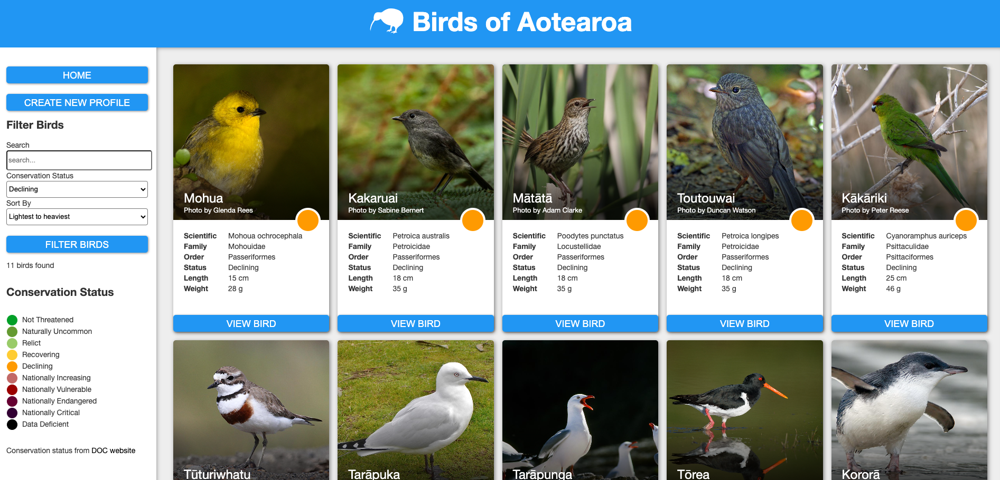

# Project Introduction: 

## Project Title: Birds of Aotearoa. 

### Introduction:
This website hosts a comprehensive catalog of New Zealand's bird species. Users can effortlessly search for birds using either their English or Maori names. Additionally, the platform allows users to filter and sort the bird species by alphabetical order, height, width, and conservation status, providing a user-friendly and informative resource for bird enthusiasts and conservationists.

### Project HighLights: 

1. Bird Database: This website feature a meticulously curated database of all bird species native to New Zealand Aotearoa. You can search for birds using their `ENGLISH` or `Maori` names, making it easy for both locals and international birdwatcher to identify their feathered friends. 
2. Conservation status: This website provide detail information about the conservation status of each bird species, helping raise awareness about their protection and preservation. 
3. Sorting Options: This website provide flexibility to explor and study the birds according to your preferences, you can sort the birds alphabetically, by their height, width, or their conservation status, making your birdwatching experience more personalized and enjoyable.

## Demos: 

# Credit: 
[Birds data](https://www.doc.govt.nz/nature/conservation-status/)
